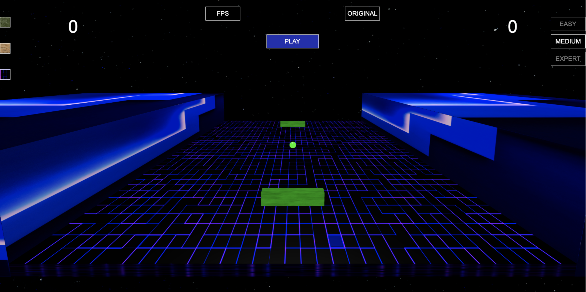

# PONG3D



Ce projet est un jeu développé en utilisant Babylon.js inspiré du célèbre jeu de PONG.

Installation
Clonez ce dépôt :
```bash
git clone https://github.com/votre-utilisateur/votre-projet.git
```

Accédez au répertoire du projet :
```bash
cd votre-projet
```
Installez les dépendances :
```bash
npm install
```
Lancer le Jeu
```bash
npm run dev
```
Ouvrez votre navigateur et accédez à l'URL spécifié pour jouer au jeu.
